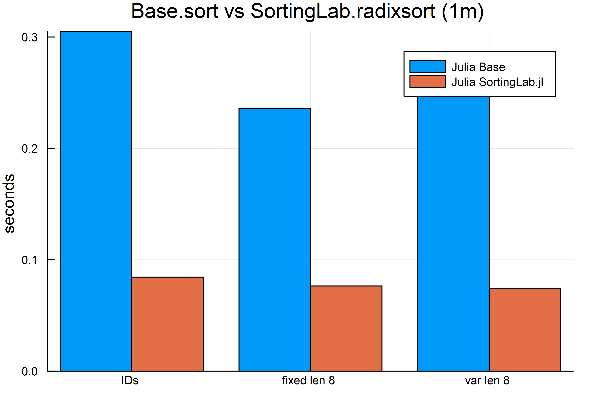

# SortingLab
Experimental implementation of sorting algorithms and APIs. If proven to be useful they will be contributed back to Julia base or SortingAlgorithms.jl in time

# Faster String Sort and Sortperm

## Usage
```julia
using SortingLab;

N = 1_000_000;
K = 100;

svec = rand("id".*dec.(1:N÷K, 10), N);
svec_sorted = radixsort(svec);
issorted(svec_sorted) # true
issorted(svec) # false

# faster sortperm
sorted_idx = fsortperm(svec)
issorted(svec[sorted_idx])

# in place sort
radixsort!(svec);
issorted(svec) # true
```

## Benchmark


## Benchmarking code
```julia
using SortingLab;
using BenchmarkTools;

N = 1_000_000;
K = 100;

tic()
svec = rand("id".*dec.(1:N÷K, 10), N);
sort_id_1m = @belapsed sort($svec);
radixsort_id_1m = @belapsed radixsort($svec);

sortperm_id_1m = @belapsed sortperm($svec);
fsortperm_id_1m = @belapsed fsortperm($svec);

rsvec = rand([randstring(rand(1:32)) for i = 1:N÷K], N);
sort_r_1m = @belapsed sort($rsvec);
radixsort_r_1m = @belapsed radixsort($rsvec);

sortperm_r_1m = @belapsed sortperm($rsvec);
fsortperm_r_1m = @belapsed fsortperm($rsvec);
toc()

tic()
using Plots
using StatPlots
groupedbar(
    repeat(["IDs", "random len 32"], inner=4), 
    [sort_id_1m, radixsort_id_1m, sortperm_id_1m, fsortperm_id_1m, sort_r_1m, radixsort_r_1m, sortperm_r_1m, fsortperm_r_1m], 
    group = repeat(["sort","radixsort", "sortperm", "fsortperm"], outer = 2),
    title = "Strings sorting perf (1m): Base.sort vs SortingLab.radixsort")
savefig("benchmarks/sort_vs_radixsort.png")
toc()
```


# Build status
[](https://travis-ci.org/xiaodaigh/SortingLab.jl)

[](https://coveralls.io/github/xiaodaigh/SortingLab.jl?branch=master)

[](http://codecov.io/github/xiaodaigh/SortingLab.jl?branch=master)
