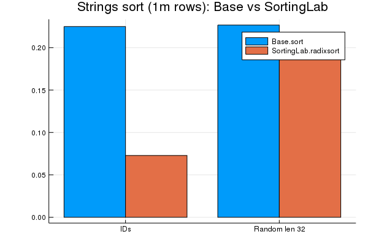
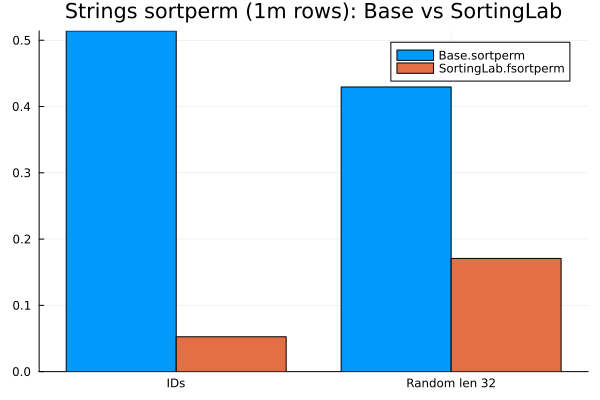

# SortingLab
Experimental implementation of sorting algorithms and APIs. If proven to be useful they will be contributed back to Julia base or SortingAlgorithms.jl in time

# Faster String Sort and Sortperm & CategoricalArrays Sort

## Usage
```julia
using SortingLab;
import Test: @test

N = 1_000_000;
K = 100;

# faster string sort
svec = rand("id".*string.(1:N÷K, pad=10), N);
svec_sorted = radixsort(svec);
issorted(svec_sorted) # true
issorted(svec) # false

# faster string sortperm
sorted_idx = fsortperm(svec)
issorted(svec[sorted_idx]) #true

# in place string sort
radixsort!(svec);
issorted(svec) # true

# CategoricalArray sort
using CategoricalArrays
pools = "id".*string.(1:100,3);
byvec = CategoricalArray{String, 1}(rand(UInt32(1):UInt32(length(pools)), N), CategoricalPool(pools, false));
byvec = compress(byvec);

byvec_sorted = fsort(byvec);
@test issorted(byvec_sorted)

# in place CategoricalArray sort
fsort!(byvec)
@test issorted(byvec)

```

## Benchmark




## Benchmarking code
```julia
using SortingLab;
using BenchmarkTools;
import Random: randstring

N = 1_000_000;
K = 100;

tic()
svec = rand("id".*string.(1:N÷K, pad=10), N);
sort_id_1m = @belapsed sort($svec);
radixsort_id_1m = @belapsed radixsort($svec);

sortperm_id_1m = @belapsed sortperm($svec);
fsortperm_id_1m = @belapsed fsortperm($svec);

rsvec = rand([randstring(rand(1:32)) for i = 1:N÷K], N);
sort_r_1m = @belapsed sort($rsvec);
radixsort_r_1m = @belapsed radixsort($rsvec);

sortperm_r_1m = @belapsed sortperm($rsvec);
fsortperm_r_1m = @belapsed fsortperm($rsvec);
toc()

tic()
using Plots
using StatPlots
groupedbar(
    repeat(["IDs", "Random len 32"], inner=2),
    [sort_id_1m, radixsort_id_1m, sort_r_1m, radixsort_r_1m],
    group = repeat(["Base.sort","SortingLab.radixsort"], outer = 2),
    title = "Strings sort (1m rows): Base vs SortingLab")
savefig("benchmarks/sort_vs_radixsort.png")

groupedbar(
    repeat(["IDs", "Random len 32"], inner=2),
    [sortperm_id_1m, fsortperm_id_1m, sortperm_r_1m, fsortperm_r_1m],
    group = repeat(["Base.sortperm","SortingLab.fsortperm"], outer = 2),
    title = "Strings sortperm (1m rows): Base vs SortingLab")
savefig("benchmarks/sortperm_vs_fsortperm.png")
toc()
```


# Build status
[](https://travis-ci.org/xiaodaigh/SortingLab.jl)

[](https://coveralls.io/github/xiaodaigh/SortingLab.jl?branch=master)

[](http://codecov.io/github/xiaodaigh/SortingLab.jl?branch=master)
