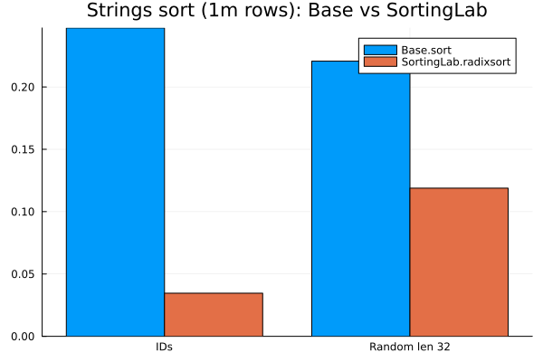

# SortingLab
Experimental implementation of sorting algorithms and APIs. If proven to be useful they will be contributed back to Julia base or SortingAlgorithms.jl in time

# Faster String Sort

``julia
using SortingLab;
using BenchmarkTools;

N = 1_000_000;
K = 100;

svec = rand("id".*dec.(1:N÷K, 10), N);
sort_id_1m = @belapsed sort($svec);
radixsort_id_1m = @belapsed radixsort($svec);

rsvec = rand([randstring(rand(1:32)) for i = 1:N÷K], N);
sort_r_1m = @belapsed sort($svec);
radixsort_r_1m = @belapsed radixsort($svec);

using Plots
using StatPlots
groupedbar(
    repeat(["IDs", "random len 32"], inner=2), 
    [sort_id_1m, radixsort_id_1m,sort_r_1m,radixsort_r_1m], 
    group = repeat(["sort","radixsort"], outer = 2),
    title = "Strings sorting perf (1m): Base.sort vs SortingLab.radixsort")
```


# Build status
[](https://travis-ci.org/xiaodaigh/SortingLab.jl)

[](https://coveralls.io/github/xiaodaigh/SortingLab.jl?branch=master)

[](http://codecov.io/github/xiaodaigh/SortingLab.jl?branch=master)
